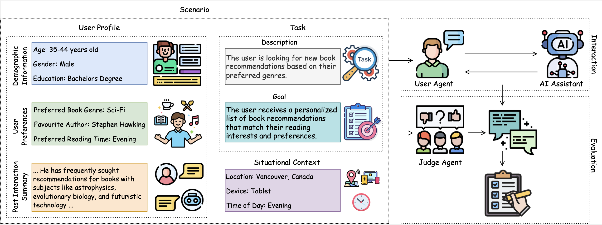

# PersonaLens: A Benchmark for Personalization Evaluation in Conversational AI Assistants
<p align="center" width="100%">
 
</p>


PersonaLens is a comprehensive benchmark designed to evaluate how well AI assistants can personalize their responses while completing tasks. Unlike existing benchmarks that focus on chit-chat, non-conversational tasks, or narrow domains, PersonaLens captures the complexities of personalized task-oriented assistance through rich user profiles, diverse tasks, and an innovative multi-agent evaluation framework.


## Overview
PersonaLens features:

- Rich user profiles with diverse preferences and interaction histories
- 100+ tasks spanning 20 domains
- Two specialized LLM-based agents:
    - User agent that simulates realistic task-oriented dialogues
    - Judge agent that evaluates personalization quality, response quality, and task success

## Project Structure

```bash
PersonaLens/
│
├── src/
│   ├── generate_dialogue.py       # Generate dialogues between user agent and AI assistant
│   └── evaluate_dialogue.py       # Evaluate dialogues using judge agent
│
├── data/
│   ├── profile/                   # User profiles with preferences and interaction history
│   └── task/                      # Task specifications across multiple domains
│
└── util/
    ├── <utility_files>            # Helper functions and utilities          

```

## Installation

Ensure you have Python 3.11+ installed. Install dependencies using:

```bash
pip install -r requirements.txt
```

## Usage
### 1. Dialogue Generation
Use the `generate_dialogue.py` script to generate dialogues between the user agent and an AI assistant:
```bash
./generate_dialogue.sh

# or modify below example

python3 -m src.generate_dialogue --start_index 0 --end_index 1499 
```
Arguments:
- `--start_index` or `-s`: The starting index of the user profiles. Default is 0.
- `--end_index` or `-e`: The ending index of the user profiles. Default is 1499.
- `--sample_30` or `-s3`: Whether to use a small sample of 30 users.
- `--sample_50` or `-s5`: Whether to use a small sample of 50 users.
- `--sample_100` or `-s10`: Whether to use a small sample of 100 users.
- `--bedrock_region` or `-r`: The Bedrock region. Default is `us-east-1`.
- `--model_id_user` or `-u`: The model id of the user agent used in the dialogue generation. Default is `claude-3-sonnet-v1`.
- `--model_id_asst` or `-m`: The model id of the assistant used in the dialogue generation. Default is `claude-3-sonnet-v1`.
- `--demographic` or `-d`: Whether to to include demographic profile in assistant prompt.
- `--past_interaction_summary` or `-p`: Whether to to include past interaction summary in assistant prompt.
- `--situation` or `-si`: Whether to to include situational context in assistant prompt.

The above is for generate dialogue on single-domain (SD) tasks. For multi-domain (MD) dialogues,use the script `generate_dialogue_md.py`, or run `python3 -m src.generate_dialogue_md`. Supported assistant models include:
- `claude-3-haiku-v1`
- `claude-3-sonnet-v1`
- `claude-3-5-haiku-v1`
- `llama-3-1-8b-instruct-v1`
- `llama-3-1-70b-instruct-v1`
- `mistral-7b-instruct-v2`
- `mixtral-8x7b-instruct-v1`

The generated dialogues are saved to `output/dialogue/{user_id}/{assistant_model_id}/`, and the filename is `{task_id}_dialogue.json`.

### 2. Dialogue Evaluation
Evaluate generated dialogues using the judge agent:

```bash
./evaluate_dialogue.sh

# or modify below example

python3 -m src.evaluate_dialogue --start_index 0 --end_index 1499 -m claude-3-sonnet-v1 -d personalization 
```
Arguments:
- `--start_index` or `-s`: The starting index of the user profiles. Default is 0.
- `--end_index` or `-e`: The ending index of the user profiles. Default is 1499.
- `--sample_30` or `-s3`: Whether to use a small sample of 30 users.
- `--sample_50` or `-s5`: Whether to use a small sample of 50 users.
- `--sample_100` or `-s10`: Whether to use a small sample of 100 users.
- `--bedrock_region` or `-r`: The Bedrock region. Default is `us-east-1`.
- `--model_id_asst` or `-m`: The model id of the assistant used in the dialogue generation. Default is `claude-3-sonnet-v1`.
- `--model_id_eval` or `-i`: The model id of the judge agent used in evaluating the dialogue. Default is `claude-3-5-sonnet-v2`.
- `--multi_domain` or `-md`: Whether to run evaluation on multi-domain task dialogues.
- `--eval_dimension` or `-d`: The evaluation dimension for the dialogue. Choose from: `task_completion`, `personalization`, `naturalness`, and `coherence`.
- `--assistant` or `-a`: Whether to run evaluation (only for `naturalness` and `coherence`) on assistance utterances. If not specified, then evaluation will be ran on user utterances. 

The evaluatation results will be saved to `output/evaluation/{user_id}/{assistant_model_id}/{evaluation_dimension}/{judge_model_id}`, and the file name will be `{task_id}{file_ext}.txt`, where `file_ext` can be `""` (`task_completion` and `personalization`), `_user` (`naturalness` and `coherence`), or `_asst` (`naturalness` and `coherence`). 

### 3. Gather Evaluation Results
Once the evaluation is completed, compile evaluation results:

```bash
./gather_evaluation.sh

# or modify below example

python3 -m util.gather_evaluation -start_index 0 --end_index 1499 -m claude-3-sonnet-v1 -d personalization 
```
Arguments:
- `--start_index` or `-s`: The starting index of the user profiles. Default is 0.
- `--end_index` or `-e`: The ending index of the user profiles. Default is 1499.
- `--sample_30` or `-s3`: Whether to use a small sample of 30 users.
- `--sample_50` or `-s5`: Whether to use a small sample of 50 users.
- `--sample_100` or `-s10`: Whether to use a small sample of 100 users.
- `--model_id_asst` or `-m`: The model id of the assistant used in the dialogue generation. 
- `--multi_domain` or `-md`: Whether to run evaluation on multi-domain task dialogues.
- `--eval_dimension` or `-d`: The evaluation dimension for the dialogue. Choose from: `task_completion`, `personalization`, `naturalness`, and `coherence`.
- `--file_ext` or `-f`: The file extension (only useful for `naturalness` and `coherence`) for evaluation results. Use `_user` for user evaluation, and `_asst` for assistant evaluation.  

## Citations
```
@article{zhao-etal-2025-personalens,
  title={PersonaLens: A Benchmark for Personalization Evaluation in Conversational AI Assistants},
  author={Zhao, Zheng and Vania, Clara and Kayal, Deep and Khan, Naila and Cohen, Shay B and Yilmaz, Emine},
  year={2025}
}
```

## License
This library is licensed under the CC-BY-NC-4.0 License.

## Security
See [CONTRIBUTING](CONTRIBUTING.md#security-issue-notifications) for more information.