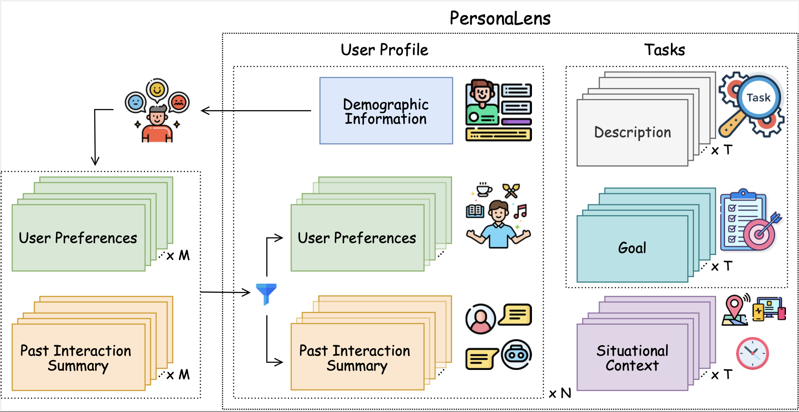

# PersonaLens Data
<p align="center" width="100%">
 
</p>


This directory contains the data for the PersonaLens benchmark, which evaluates personalization capabilities in task-oriented AI assistants.

## Dataset Structure
```bash
data/
│
├── profile/
│   ├── <user_folders>/  
│       ├── profile.json        # Rich user profiles with preferences and interaction history
│       ├── tasks.json          # Single-domain (SD) tasks for this user
│       └── tasks_md.json       # Multi-domain (MD) tasks for this user
└── task/
    ├── <domains>/      
        └── task.jsonl          # Domain-specific task definitions
    └── multi_domain/
        └── task.jsonl          # Cross-domain task definitions
```

## User Profile

The `profile/` folder contains detailed user profiles that are used by the User Agent to simulate realistic task-oriented dialogues. Each user profile consists of:

### Profiles
`profile.json` 

This file captures user affinities, demographics, interests, and interaction histories across multiple domains:

1. **Affinities**: Detailed user preferences and behavioral tendencies across different domains. Each domain includes various preference attributes that influence how the user interacts with an AI assistant.
2. **Demographics**: User background information such as age and gender, providing context that helps in personalizing responses.
3. **Interests**: A binary representation (1 = interested, 0 = not interested) of user engagement across the 20 domains covered in the benchmark.
4. **Interactions**: Records of past user activities related to each domain, containing summarized interaction details that establish user history.


### Task Files
- `tasks.json`: Contains single-domain tasks specific to this user's interests
- `tasks_md.json`: Contains multi-domain tasks that span multiple areas of the user's interests

These files include only tasks from domains the user is interested in (as indicated in the profile's "interests" section). Each task includes relevant affinity types that correspond to the preferences in the user profile.

## Task Definitions
The `task/` folder contains standardized task definitions across 20 domains plus multi-domain scenarios. These tasks are designed to evaluate how well AI assistants can personalize their responses while successfully completing user requests.

### Domain Organization
- **20 Domain-Specific Folders**: Each folder corresponds to one of the domains covered in the benchmark (e.g., productivity, travel, health, entertainment)
- **Multi-Domain Folder**: Contains tasks that span multiple domains, requiring the assistant to integrate preferences from different contexts

### Task Structure
Each task is defined with the following fields:
- `Task Number`: A unique identifier for the task
- `Task Description`: A detailed explanation of what the user wants to accomplish
- `User Intent`: A concise representation of the user's request
- `Task Goal`: The specific outcome that would constitute successful task completion
- `Relevant Affinity Types`: Categories of user preferences that should influence how the task is completed
- `Relevant Domains`: The domain(s) that the task belongs to

## Usage in the Benchmark
These data files work together to create realistic personalized dialogue scenarios:
1. A user profile is selected with its associated preferences and history
2. A task relevant to the user's interests is chosen
3. The User Agent uses this information to simulate a dialogue with an AI assistant
4. The Judge Agent evaluates the assistant's responses based on how well they incorporate user preferences while completing the task

For more details on how to use this data with the PersonaLens benchmark, refer to the main [README](../README.md). Below is an example usage of our benchmark. 

<p align="center" width="100%">
 
</p>

